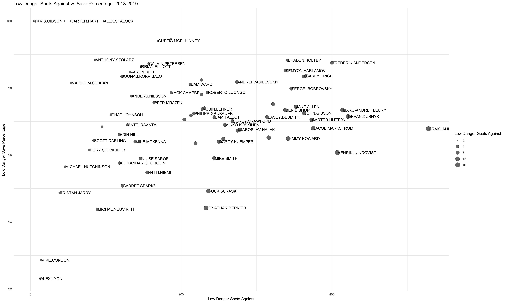
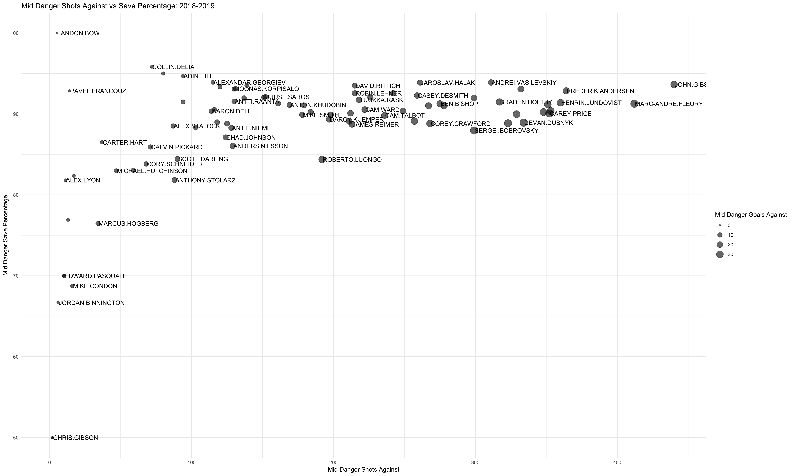
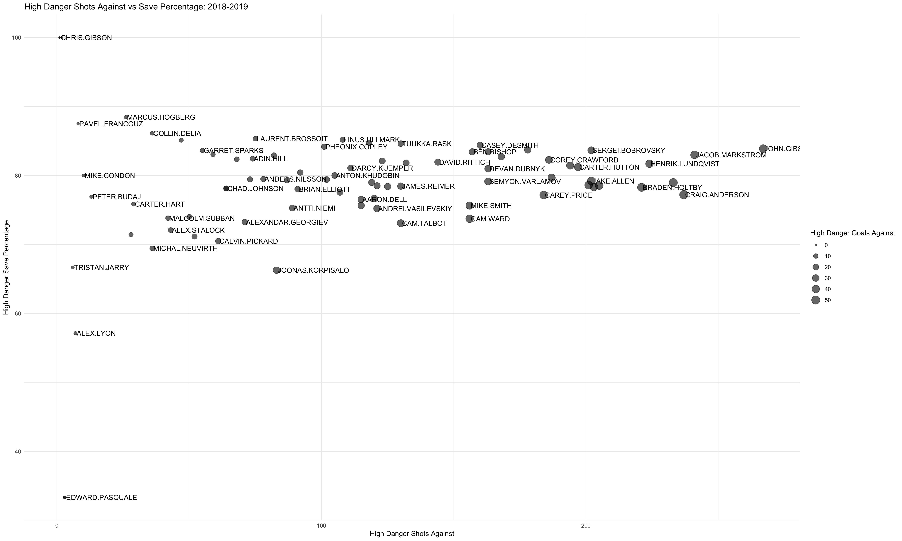

# NHL Goalie Starter Model
Neural Network Model to Determine if an NHL Goalie is Starter Caliber

Also, graphing how goalies fare against low danger, mid danger, and high danger shots.

## Graphs

### Low Danger

### Mid Danger

### High Danger

